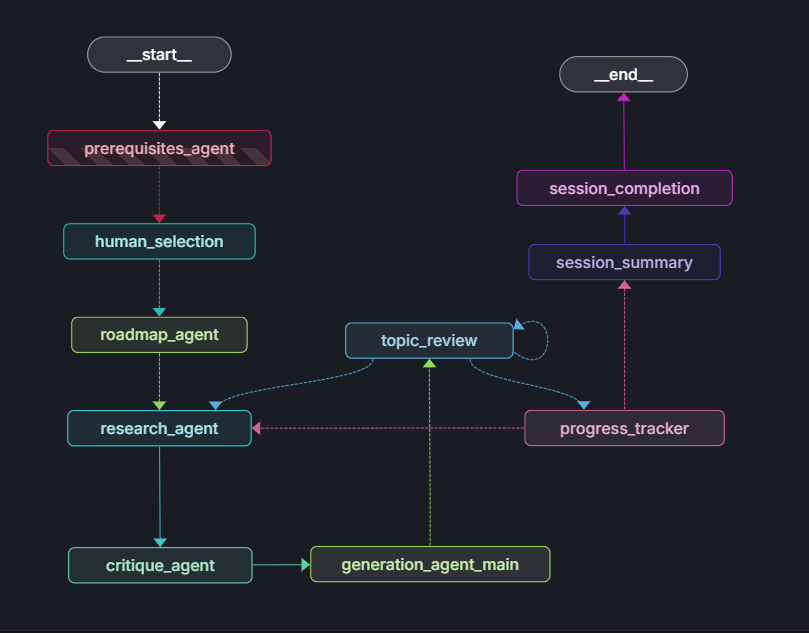

# Agentic Tutor

An intelligent agentic workflow created using LangGraph for helping students learn ML and AI topics through personalized learning paths with human-in-the-loop interaction.

## Project Status: Major Refactor Complete ✅

The project has undergone a significant refactoring to a modular, scalable architecture. The core logic is now separated into distinct modules for state, nodes, routing, and utilities, making the system more maintainable and ready for API integration. Key bugs have been resolved, and a formal process for tracking bugs and features is now in place.

### ✅ Implemented Features

#### Core Workflow
- **🔍 Smart Prerequisites Discovery**: Identifies specific ML/AI prerequisites for a given topic.
- **👤 Human-in-the-Loop Selection**: Uses LangGraph's `interrupt()` feature to allow users to select their known prerequisites.
- **🗺️ Personalized Roadmaps**: Creates optimal learning sequences based on the user's knowledge gaps.
- **📊 Progress Tracking**: Automatically progresses through the learning roadmap topic-by-topic.

#### Multi-Agent Architecture
- **🔬 Research Agent**: Uses Tavily to perform web searches for up-to-date information.
- **🧐 Critique Agent**: Reviews and validates the quality and completeness of the research.
- **📝 Generation Agent**: Creates structured educational content and handles Q&A.

#### Technical Implementation  
- **🧩 Modular Project Architecture**: The codebase is now highly modular, with logic separated into `core`, `nodes`, `routing`, and `utils`.
- **💾 Conversation Memory**: LangGraph checkpointing with `MemorySaver` enables session persistence.
- **🔄 Async Support**: Fully asynchronous implementation for a responsive and non-blocking workflow.
- **🛠️ Robust State Management**: Pydantic models provide type-safe state management.
- **📄 Formal Documentation**: `BUGS.md` and `FEATURES.md` are now used to track project status.

#### Recent Bug Fixes
- ✅ **Resolved Question Tracking**: Questions are now reliably tracked in the agent's state, fixing the inaccurate count in the session summary.
- ✅ **Identified Roadmap Generation Bug**: Pinpointed the root cause of the "all-but-one" prerequisite bug, which was due to an ambiguous LLM prompt.

### 🐛 Bugs and ✨ Features

This project now uses dedicated markdown files to track bugs and plan future features.

-   **[View Current Bugs](./BUGS.md)**
-   **[View Feature Roadmap](./FEATURES.md)**

---

## Architecture Overview

The agentic workflow is structured as a state graph, allowing for complex, conditional routing between different functional nodes. The diagram below illustrates the flow from the initial topic selection to the final session summary.



---

## Quick Start

### Prerequisites
- Python 3.9+
- A Google API key for the Gemini model family.
- A Tavily API key for the web search functionality.

### Installation & Setup

1.  **Clone the repository and navigate to the project root.**

2.  **Install dependencies**:
    ```bash
    pip install -r requirements.txt
    ```

3.  **Set up environment variables**:
    Create a `.env` file in the project root and add your API keys:
    ```env
    # Required for core functionality
    GOOGLE_API_KEY="your_google_api_key_here"
    TAVILY_API_KEY="your_tavily_api_key_here"
    
    # Optional (for LangSmith tracing)
    LANGSMITH_API_KEY="your_langsmith_api_key_here"
    LANGSMITH_TRACING="true"
    LANGSMITH_PROJECT="agentic-tutor"
    ```

### Running the Application

The primary way to run the application is through the Streamlit UI.

```bash
streamlit run app.py
```

### Usage Example (Programmatic)

You can also interact with the workflow programmatically. This is useful for testing or embedding the agent in other applications.

```python
from agentic-tutor.src.agent.workflow import graph_with_memory

# Use a unique ID for each session to maintain state
config = {"configurable": {"thread_id": "my-learning-session-1"}}

# Start a new learning session
initial_state = {"initial_topic": "Q-Learning"}
events = graph_with_memory.stream(initial_state, config, stream_mode="values")

for event in events:
    # Process events as they stream in
    print(event)

# You can resume the session later using the same thread_id
snapshot = graph_with_memory.get_state(config)
print(f"Current topic: {snapshot.values['current_topic']}")
```

## Technical Stack

- **Framework**: LangGraph
- **LLM**: Google Gemini
- **Search**: Tavily
- **State Management**: Pydantic
- **UI**: Streamlit

## Contributing

Contributions are welcome! Please see the **[Feature Roadmap](./FEATURES.md)** for high-priority items to work on.

1.  Fork the repository.
2.  Create a feature branch.
3.  Add tests for your new functionality.
4.  Submit a pull request for review.

## License

This project is licensed under the MIT License. See the [LICENSE](./LICENSE) file for details.

