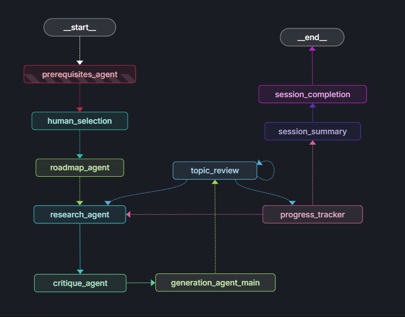

# Agentic Tutor

An intelligent agentic workflow created using LangGraph for helping students learn ML and AI topics through personalized learning paths with human-in-the-loop interaction.

## Project Status: Production Ready ✅

The project has been successfully implemented with a complete agentic tutoring workflow featuring streaming responses, interactive interrupts, and full API integration. All core functionality is working as expected, including the prerequisite selection system, personalized learning roadmaps, and seamless human-in-the-loop interactions.

### ✅ Implemented Features

#### Core Workflow
- **🔍 Smart Prerequisites Discovery**: Automatically identifies specific ML/AI prerequisites for any given topic
- **👤 Interactive Prerequisite Selection**: Fully functional human-in-the-loop selection with LangGraph interrupts
- **🗺️ Personalized Learning Roadmaps**: Creates optimal learning sequences based on user's actual knowledge gaps
- **📚 Adaptive Content Generation**: Multi-agent research, critique, and generation for up-to-date lessons
- **🔄 Interactive Learning Flow**: Topic reviews, Q&A sessions, and regeneration options
- **📊 Intelligent Progress Tracking**: Automatically advances through personalized roadmaps

#### Multi-Agent Architecture
- **🔬 Research Agent**: Uses Tavily to perform web searches for up-to-date information.
- **🧐 Critique Agent**: Reviews and validates the quality and completeness of the research.
- **📝 Generation Agent**: Creates structured educational content and handles Q&A.

#### Technical Implementation  
- **🧩 Modular Architecture**: Clean separation of concerns with `core`, `nodes`, `routing`, and `utils` modules
- **💾 Persistent Memory**: LangGraph checkpointing with `MemorySaver` for seamless session continuity
- **🔄 Full Async Support**: Non-blocking asynchronous implementation throughout the entire stack
- **🛠️ Type-Safe State Management**: Pydantic models ensure robust data validation and serialization
- **⚡ Real-Time Streaming**: Token-level streaming with Server-Sent Events (SSE) in both UI and API
- **🌐 Production-Ready API**: FastAPI server with comprehensive error handling and auto-documentation
- **🔧 Robust Serialization**: Custom serialization handling for complex LangChain objects
- **📊 Comprehensive Testing**: End-to-end testing with multiple test clients and edge case coverage

#### Recent Updates (v1.1.0 - Production Release)
- ✅ **Complete Streaming Implementation**: Real-time token-level streaming working in both Streamlit UI and FastAPI
- ✅ **Interactive Prerequisite Selection**: Fixed and fully functional - users can select known prerequisites correctly
- ✅ **JSON Serialization Resolved**: BaseMessage serialization working with recursive `model_dump()` approach
- ✅ **Full API Integration**: FastAPI server with SSE streaming, session management, and interrupt handling
- ✅ **End-to-End Testing**: All workflows tested from start to completion including edge cases
- ✅ **Robust Error Handling**: Comprehensive error handling and recovery mechanisms
- ✅ **Production Ready**: All major bugs resolved, system stable and performant

### 🎯 Current Status: Fully Functional

**All Core Features Working:**
- ✅ **Complete End-to-End Workflow**: From topic input to personalized learning completion
- ✅ **Interactive Prerequisite Selection**: Users can accurately select known prerequisites
- ✅ **Dynamic Roadmap Generation**: Learning paths adapt based on actual user knowledge
- ✅ **Real-Time Streaming**: Token-level streaming in both Streamlit UI and FastAPI
- ✅ **Session Persistence**: Workflows resume seamlessly across interrupts
- ✅ **Multi-Modal Integration**: Works via UI, API, and programmatic interfaces
- ✅ **Production Ready**: Robust error handling, comprehensive testing, full documentation

**Ready for:**
- 🚀 **Production Deployment**: All systems stable and tested
- 🔌 **External Integration**: Complete REST API with comprehensive documentation
- 📱 **Custom Applications**: Easy integration into existing platforms (e.g., LibreChat)
- 🧪 **Further Development**: Clean, modular architecture ready for extensions

### 🐛 Bugs and ✨ Features

This project uses dedicated markdown files to track any remaining issues and future enhancements.

-   **[View Current Bugs](./BUGS.md)** (Minimal - all major issues resolved)
-   **[View Feature Roadmap](./FEATURES.md)** (Enhancement opportunities)

---

## Architecture Overview

The agentic workflow is structured as a state graph, allowing for complex, conditional routing between different functional nodes. The diagram below illustrates the flow from the initial topic selection to the final session summary.



---

## Quick Start

### Prerequisites
- Python 3.9+
- A Google API key for the Gemini model family.
- A Tavily API key for the web search functionality.

### Installation & Setup

1.  **Clone the repository and navigate to the project root.**

2.  **Install dependencies**:
    ```bash
    pip install -r requirements.txt
    ```

3.  **Set up environment variables**:
    Create a `.env` file in the project root and add your API keys:
    ```env
    # Required for core functionality
    GOOGLE_API_KEY="your_google_api_key_here"
    TAVILY_API_KEY="your_tavily_api_key_here"
    
    # Optional (for LangSmith tracing)
    LANGSMITH_API_KEY="your_langsmith_api_key_here"
    LANGSMITH_TRACING="true"
    LANGSMITH_PROJECT="agentic-tutor"
    ```

### Running the Application

#### Option 1: Streamlit UI (Recommended for Learning)

The primary way to interact with the tutoring system is through the beautiful Streamlit interface:

```bash
streamlit run app.py
```

This provides an interactive, user-friendly experience with:
- **Real-time streaming responses** (token-by-token display)
- **Interactive prerequisite selection** (checkbox interface)
- **Visual progress tracking** through learning roadmaps
- **Interactive lesson reviews and Q&A** with regeneration options
- **Session persistence** and history tracking

#### Option 2: FastAPI Server (For External Integration)

For integrating the tutor into external applications, use the REST API:

```bash
python api_server.py
```

This starts a FastAPI server on `http://localhost:8000` with:
- **Streaming endpoints** with Server-Sent Events (SSE)
- **Session management** with stateful workflows
- **RESTful API** for easy integration
- **Auto-generated documentation** at `/docs`

**Quick API Examples:**
```bash
# Start a streaming session
curl -N -X POST "http://localhost:8000/tutor/stream/my_session" \
  -H "Content-Type: application/json" \
  -d '{"topic": "Neural Networks", "stream_tokens": true}'

# Resume with prerequisite selection
curl -X POST "http://localhost:8000/tutor/resume/my_session" \
  -H "Content-Type: application/json" \
  -d '{"action": "select_prerequisites", "known_prerequisites": ["Linear Algebra", "Calculus"]}'

# Continue after topic review
curl -X POST "http://localhost:8000/tutor/resume/my_session" \
  -H "Content-Type: application/json" \
  -d '{"action": "continue"}'
```

For detailed API documentation, see **[API_GUIDE.md](./API_GUIDE.md)**

**API Features:**
- ✅ **Real-time Token Streaming**: Server-Sent Events (SSE) for immediate response feedback
- ✅ **Session Management**: Stateful workflows with persistent memory across interactions
- ✅ **Interactive Interrupts**: Human-in-the-loop prerequisite selection and topic reviews
- ✅ **Prerequisite Selection**: Fully functional prerequisite filtering and roadmap generation
- ✅ **Resume Functionality**: Seamless workflow continuation after user interactions
- ✅ **Comprehensive Error Handling**: Robust error recovery and user feedback
- ✅ **Auto-generated Documentation**: OpenAPI/Swagger UI at `/docs` endpoint
- ✅ **Test Clients**: HTML and Python test clients for easy API exploration

### Usage Example (Programmatic)

You can also interact with the workflow programmatically. This is useful for testing or embedding the agent in other applications.

```python
from agentic-tutor.src.agent.workflow import graph_with_memory

# Use a unique ID for each session to maintain state
config = {"configurable": {"thread_id": "my-learning-session-1"}}

# Start a new learning session
initial_state = {"initial_topic": "Q-Learning"}
events = graph_with_memory.stream(initial_state, config, stream_mode="values")

for event in events:
    # Process events as they stream in
    print(event)

# You can resume the session later using the same thread_id
snapshot = graph_with_memory.get_state(config)
print(f"Current topic: {snapshot.values['current_topic']}")
```

## Technical Stack

- **Framework**: LangGraph
- **LLM**: Google Gemini
- **Search**: Tavily
- **State Management**: Pydantic
- **UI**: Streamlit
- **API**: FastAPI with Server-Sent Events (SSE)
- **Deployment**: Uvicorn

## Contributing

Contributions are welcome! Please see the **[Feature Roadmap](./FEATURES.md)** for high-priority items to work on.

1.  Fork the repository.
2.  Create a feature branch.
3.  Add tests for your new functionality.
4.  Submit a pull request for review.

## License

This project is licensed under the MIT License. See the [LICENSE](./LICENSE) file for details.

